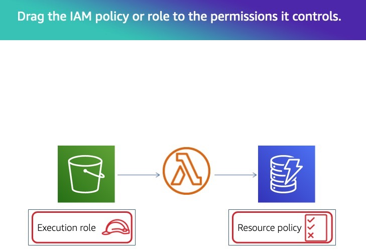

# AWS Lambda Self-check

1. Which of the following statements are true?

Solution
* If Lambda is unable to invoke a function triggered by a 
message in an SQS queue, the falied invoke will go to the 
dead-letter  queue (if onde is configured).
* Amazon S3 triggers Lambda asynchronously.

2. What is the unit at which scalling is measured for lambda funcions?

* Concurrency

3. Match each concept to its related behavior.

* Launch environmentm download code, initialize dependencies, run code.
  * Cold Start
* Thaw container, run code.
  * Warm  Start
* Concurrent invocations increse to regional immediate concurrency increase level.
  * Burst
* Invocations of a function are throttled when a configured limit is reached.
  * Reserved Concurrency
* Long-running funcion is halted before completion.
  * Timeout

4. You've been asked to reduce the duration of a production Lambda funcion to save 
on billable costs. You've been told that it runs for 5 minutes. Which of these actons
would you take?

* Test at higher memory configurations and compare duration and cost at 
each configuration.
* Check to see if there are SDK components in the deploy package that aren't necessary.
* Confirm whether 5 minutes is the typical duration through production monitoring.

5. In a stream-based event source, the number of concurrent Lambda execution will equal:

* The number of actives shards.

6. Which of the following statements about serveless deployments are true?

* You can model your infraestructure in a AWS CloudFormation template and use that
to deploy your desired stack.
* Lambda is integrated with AWS CodeDeploy for automated rollout with traffic shifting.
* Serveless frameworks like SAM make it easy to spin up stacks for different  feature
branches so you can experiment without incurring cost outside of the actual
invocations executed on that environment.

7.

