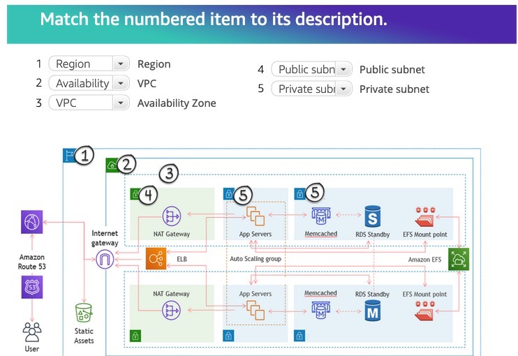
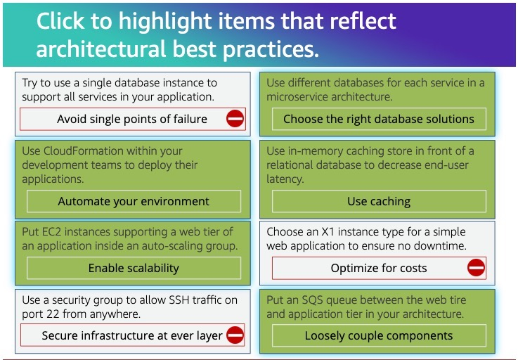

# Prerequite Self-Checks

There are four self-checks: Arquitecting on AWS, AWS Lambada, Amazon API Gateway,
and Amazon DynamoDB.

# Architecting Review

1. 
* **Security**
  * **Protect**: Information, systems, and assets while delivering business value
* **Reliability**
  * **Dynamically accquire**: Computing resources to meet demand.
* **Cost Optimization**
  * **Continuelly refine**: Cost-aware systems that meet business outcomes and minimize costs.
* **Performance Efficiency**
  * **Efficiently use and maintain**: Resources as demand and technologies evolve.
* **Operational Excellence**
  * **Gain Insight**: Into system operation to deliver busines value and continuousty improve.

2. Which of these are good candidates for using Amazon S3?

Solution
* Store and distribute static web content or media
* Data store for computation or large-scale analytics
* Backup store

3. Wich of these are true statements about AWS identity and Access Management (IAM) roles?

Solution

* Roles let you define a set of permission. The Permissions are attached
to a role, and the is asumed by a user or service.
* AWS services can programatically assume a role at runtime.
* Roles can be assumed using the console, the CLI, the AssumeRole API,
and the AWS Security Token Service (AWS STS).
* Federated users sign in using credentials provided by an identity
provider (IdP). AWS provides the IdP with temporary credentials
associated with a role to pass on to the user for inclusion in subsequent
AWS resource requests.

4. Amazon CloudWatch feature to its descriptio

Solution
* Provide data about the preformance of your systems. 
  * Metrics
* Store and access log files from sources like EC2 instances or AWS Lambda.
  * Logs
* Watch a single metric over a specified time period and perform specified actions.
  * Alarms
* Deliver near-real-time stream of system events that describe changes in AWS resource.
  * Events
* Match incomming events and route them to targets for processing
  * Rules
* Process events. Can include services like AWS Lambda functions or Amazon SNS topics.
  * Targets

5. Withc two services would you use to ensure that your EC2-based web application can scale
up and down horizontally as traffic increases/decrease?

Solution
* Amazon EC2 Auto Scaling
* Elastic Load Balancing

6. Witch of the following statements is FALSE with respect to managing state information?

Solution
* HTTP was designed to manage sets of related requests anda maintain state information during a session.

7. 

8. 

# AWS Lambda Self-check

1. Which of the following statements are true?

Solution
* If Lambda is unable to invoke a function triggered by a 
message in an SQS queue, the falied invoke will go to the 
dead-letter  queue (if onde is configured).
* Amazon S3 triggers Lambda asynchronously.

2. What is the unit at which scalling is measured for lambda funcions?

* Concurrency

3. Match each concept to its related behavior.

* Launch environmentm download code, initialize dependencies, run code.
  * Cold Start
* Thaw container, run code.
  * Warm  Start
* Concurrent invocations increse to regional immediate concurrency increase level.
  * Burst
* Invocations of a function are throttled when a configured limit is reached.
  * Reserved Concurrency
* Long-running funcion is halted before completion.
  * Timeout

4. You've been asked to reduce the duration of a production Lambda funcion to save 
on billable costs. You've been told that it runs for 5 minutes. Which of these actons
would you take?

* Test at higher memory configurations and compare duration and cost at 
each configuration.
* Check to see if there are SDK components in the deploy package that aren't necessary.
* Confirm whether 5 minutes is the typical duration through production monitoring.

5. In a stream-based event source, the number of concurrent Lambda execution will equal:

* Request rate * average function duration.